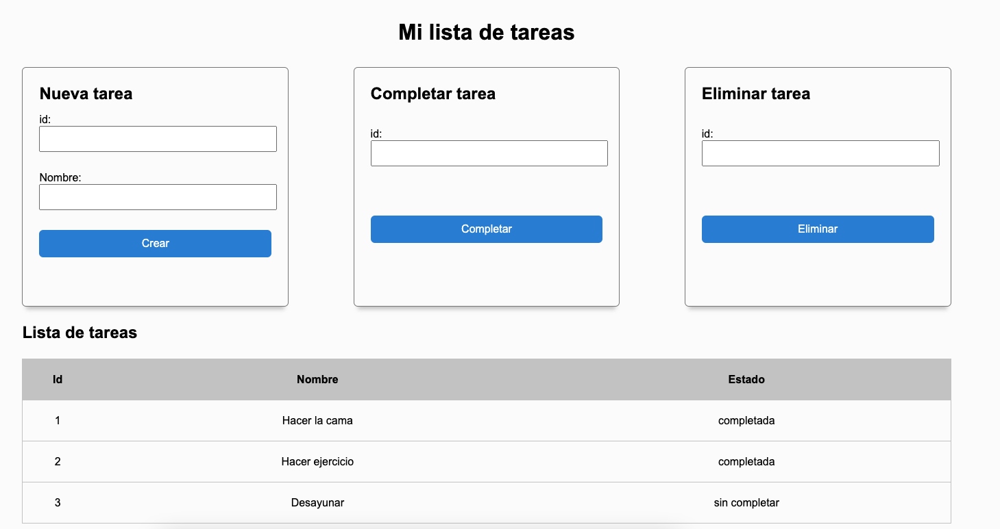

# Lab DOM

Este es un laboratorio práctico del modulo de DOM del curso JavaScript Front End de [ADA SCHOOL](https://ada-school.org/).

## ¿Qué vas a lograr?

En este laboratorio vas a aprender a interactuar con el DOM utilizando JavaScript, para ello vas utilizar varias interfaces que nos provee JavaScript.

En esta ocasión vamos a crear una página web para gestionar nuestras tareas dia a dia, para ello la página web deberá permitirnos:

- [ ] Crear y agregar tareas a una lista.
- [ ] Listar tareas creadas.
- [ ] Completar tareas.
- [ ] Eliminar tareas.

Al deberá nuestra página web debera ser algo así:

**La estructura básica HTML y los respectivos estilos CSS ya están implementados.**

## Primera Parte

### Analizando

- Dirígete a `./src/index.html` y revisa la estructura del HTML. ¿Qué tags nuevos vez?.
- Dirígete a `./src/script.js`. Revisa la constante `TASK_LIST` ¿Cual es la estructura de la lista?.
- Revisa las líneas `7` y `9`. ¿Que está haciendo la siguiente instrucción `document.body.onload = init;`?. [Revisa la documentacion oficial](https://developer.mozilla.org/en-US/docs/Web/HTML/Element/body#attr-onload).
- Revisa la función de la línea `13`. ¿Que está haciendo esta función?. ¿Cómo lo está haciendo?.
- Revisa la documentación oficial de algunas interfaces.
    - [document.createElement](https://developer.mozilla.org/es/docs/Web/API/Document/createElement).
    - [{node}.appendChild](https://developer.mozilla.org/es/docs/Web/API/Node/appendChild).
    - [{node}.removeChild](https://developer.mozilla.org/es/docs/Web/API/Node/removeChild).
    - [{element}.innerHTML](https://developer.mozilla.org/es/docs/Web/API/Element/innerHTML).
    - [{element}.innerText](https://developer.mozilla.org/en-US/docs/Web/API/HTMLElement/innerText).
    - [{element}.className](https://developer.mozilla.org/en-US/docs/Web/API/Element/className).

### Crear una nueva tarea

Vamos a impletar la cracion de tareas:

- Dirígete a `./src/index.html` y revisa la sección con el título `Nueva tarea`. Fíjate en todos los atributos de cada uno de los elementos de la sección.
- ¿Cuál debería ser el flujo que el usuario debe realizar para crear una tarea?.
- ¿Qué acción o evento debería hacer que nuestra página web cree una nueva tarea?.
- Investiga como puedo agregar `EventListeners` a un elemento del DOM. [{element}.addEventListener](https://developer.mozilla.org/es/docs/Web/API/EventTarget/addEventListener).
- Agrega un `EventListener` al formulario de creación de tareas.
    - En la función `init()`, selecciona con ayuda del DOM, el elemento `<form>`.
    - Al elemento `<form>` agregale un `EventListener`, con el evento `submit` y el callback `addTask`.
- Implementa la logica para crear una nueva tarea.
    - Selecciona los elementos `<input>` que contendran la informacion del `id` de la tarea nueva y el `nombre` de la tarea nueva.
    - Investiga como puedo acceder a los valores de un input. [{inputElement}.value](https://developer.mozilla.org/en-US/docs/Web/API/HTMLInputElement) y [{inputElement}.valueAsNumber](https://developer.mozilla.org/en-US/docs/Web/API/HTMLInputElement)
    - Accede a los valores de los input y crea un nuevo objeto con los datos que ingresó el usuario (por defecto `completed` debería ser `false`).
    - Agrega el objeto a la lista de tareas.
    - Prueba si funciona la creacion de tareas. ¿Funcionó?. ¿No funcionó?. ¿Por qué?.
    - Ejecuta la función `loadTasks()` luego de agregar el objeto a lista de tareas.
    - Prueba si funciona la creacion de tareas. ¿Funcionó?. ¿No funcionó?. ¿Por qué?.
    - Implementa la función `removeDOMTasks` y luego ejecutala antes de llamar a `loadTasks()`.
    - Prueba si funciona la creacion de tareas. ¿Funcionó?. ¿No funcionó?. ¿Por qué?.
    - Investiga más sobre los [eventos](https://developer.mozilla.org/es/docs/Web/API/Eve) y para qué sirve la función [event.preventDefault](https://developer.mozilla.org/es/docs/Web/API/Event/preventDefault).

## Segunda Parte

### Implementa completar una tarea

Vamos a implementar el funcionamiento de completar una tarea.

- Primero piensa ¿Cuál debería ser el flujo que el usuario debe realizar para completar una tarea?.
- Agrega a `index.html` todos los elementos necesarios para poder completar una tarea.
- Agrega el `EventListener` necesario para que la página web complete la tarea.
- Implementa lógica necesaria para completar una tarea.

### Implementa eliminar una tarea

Vamos a implementar el funcionamiento de eliminar una tarea.

- Primero piensa ¿Cuál debería ser el flujo que el usuario debe realizar para eliminar una tarea?.
- Agrega a `index.html` todos los elementos necesarios para poder eliminar una tarea.
- Agrega el `EventListener` necesario para que la página web complete la tarea.
- Implementa lógica necesaria para eliminar una tarea. Para ello investiga cómo funciona la función [Array.prototype.filter()](https://developer.mozilla.org/es/docs/Web/JavaScript/Reference/Global_Objects/Array/filter) (puedes realizar los cambios que necesites a la constante `TASK_LIST` o al resto del código).

**Recuerda preguntar si tienes dudas o pedir ayuda si te encuentras atascado en el canal de salck del curso.**
